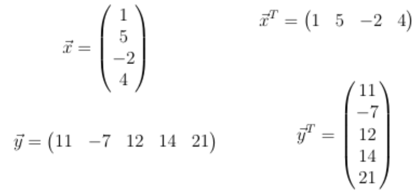
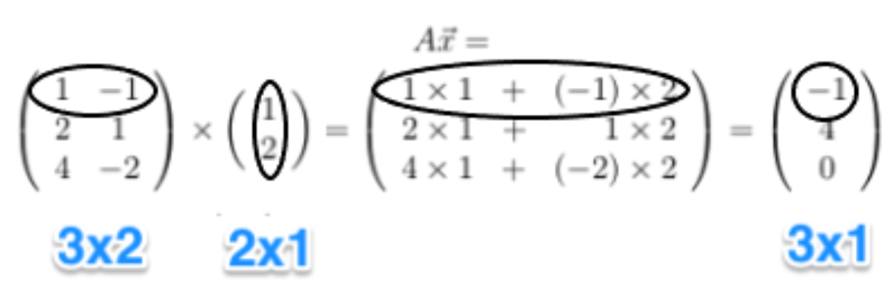
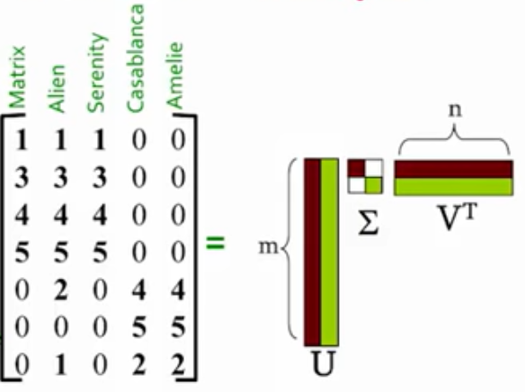

# Linear Algebra

## Vectors

## Matrix
> Defines a linear transformation

#### Covariance

#### Linear Transformations

### Matrix Vector Multiplication

### Matrix Matrix Multiplication

---

## Eigenvalue & Eigenvector

### Solve for Eigenvector & Eigenvalue
**EXAMPLE 1**

**EXAMPLE 2**

---

## Singular Value Decomposition

- **RANK**: number of linearly independent columns of A

- **U**: obs-to-concept _similarity matrix_
- **E**: strength of concept
- **U**: feats-to-concept _similarity matrix_

 - Every data point you can represent as a single number, which is the projection of a given data point on the "best" axis

 - Defines the Axis
 - 'Sigma' gives the variance on the **v1** axis

 - **NOTE**: Lots of variation along the 1st 2 axis

- Dimensionality Reduction: Set smallest singular values to zero

**EXAMPLE**

