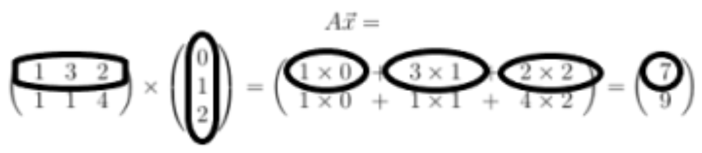

# Linear Algebra

## Vectors

## Matrix

### Matrix Vector Multiplication

### Matrix Matrix Multiplication

## Singular Value Decomposition

- **U**: user-to-concept _similarity matrix_
- **E**: strength of concept
- **U**: movie-to-concept _similarity matrix_
